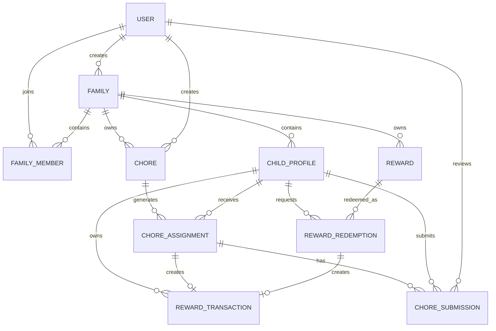

# ChorePay Database Design

## Purpose

The ChorePay database stores parent accounts, families, child profiles, chores, submissions, rewards and balance transactions.

The initial database will use PostgreSQL.

---

## Main Design Decisions

- Parents register using an email address and password.
- Children use profiles managed by a parent.
- A child can log in using a family code, profile and PIN.
- Chores are stored separately from assignments so they can be reused.
- Rewards are only issued after a parent approves a submitted chore.
- Every increase or decrease in a child's reward balance is recorded as a transaction.
- Real money is recorded by the application but is not transferred through the application.

---

## Entities

### User

Stores registered parent or guardian accounts.

| Field | Type | Rules |
|---|---|---|
| id | UUID | Primary key |
| name | VARCHAR | Required |
| email | VARCHAR | Required and unique |
| password_hash | VARCHAR | Required |
| role | VARCHAR | Default `PARENT` |
| created_at | TIMESTAMP | Required |
| updated_at | TIMESTAMP | Required |

---

### Family

Represents a household using ChorePay.

| Field | Type | Rules |
|---|---|---|
| id | UUID | Primary key |
| name | VARCHAR | Required |
| join_code | VARCHAR | Required and unique |
| created_by_id | UUID | Foreign key to User |
| created_at | TIMESTAMP | Required |
| updated_at | TIMESTAMP | Required |

---

### FamilyMember

Connects parent accounts to families.

| Field | Type | Rules |
|---|---|---|
| id | UUID | Primary key |
| family_id | UUID | Foreign key to Family |
| user_id | UUID | Foreign key to User |
| role | VARCHAR | `OWNER` or `PARENT` |
| joined_at | TIMESTAMP | Required |

A user should not appear more than once in the same family.

Unique constraint:

```text
family_id + user_id
```

---

### ChildProfile

Stores a child profile managed by a family.

| Field | Type | Rules |
|---|---|---|
| id | UUID | Primary key |
| family_id | UUID | Foreign key to Family |
| display_name | VARCHAR | Required |
| pin_hash | VARCHAR | Required |
| avatar_key | VARCHAR | Optional |
| reward_balance | INTEGER | Default `0` |
| game_coins | INTEGER | Default `0` |
| experience_points | INTEGER | Default `0` |
| active | BOOLEAN | Default `true` |
| created_at | TIMESTAMP | Required |
| updated_at | TIMESTAMP | Required |

The PIN must be hashed rather than stored as plain text.

---

### Chore

Stores a reusable chore created by a parent.

| Field | Type | Rules |
|---|---|---|
| id | UUID | Primary key |
| family_id | UUID | Foreign key to Family |
| created_by_id | UUID | Foreign key to User |
| title | VARCHAR | Required |
| description | TEXT | Optional |
| reward_points | INTEGER | Default `0` |
| game_coins | INTEGER | Default `0` |
| experience_points | INTEGER | Default `0` |
| active | BOOLEAN | Default `true` |
| created_at | TIMESTAMP | Required |
| updated_at | TIMESTAMP | Required |

Reward values must not be negative.

---

### ChoreAssignment

Assigns a chore to a child.

| Field | Type | Rules |
|---|---|---|
| id | UUID | Primary key |
| chore_id | UUID | Foreign key to Chore |
| child_id | UUID | Foreign key to ChildProfile |
| assigned_by_id | UUID | Foreign key to User |
| due_at | TIMESTAMP | Optional |
| status | VARCHAR | Default `ASSIGNED` |
| created_at | TIMESTAMP | Required |
| updated_at | TIMESTAMP | Required |

Possible statuses:

```text
ASSIGNED
SUBMITTED
APPROVED
REJECTED
CANCELLED
```

---

### ChoreSubmission

Records a child's claim that an assignment has been completed.

| Field | Type | Rules |
|---|---|---|
| id | UUID | Primary key |
| assignment_id | UUID | Foreign key to ChoreAssignment |
| child_id | UUID | Foreign key to ChildProfile |
| note | TEXT | Optional |
| proof_image_url | VARCHAR | Optional |
| submitted_at | TIMESTAMP | Required |
| reviewed_by_id | UUID | Optional foreign key to User |
| reviewed_at | TIMESTAMP | Optional |
| review_comment | TEXT | Optional |
| status | VARCHAR | Default `PENDING` |

Possible statuses:

```text
PENDING
APPROVED
REJECTED
```

Only one approved submission should exist for each assignment.

---

### Reward

Stores rewards created by a parent.

| Field | Type | Rules |
|---|---|---|
| id | UUID | Primary key |
| family_id | UUID | Foreign key to Family |
| created_by_id | UUID | Foreign key to User |
| title | VARCHAR | Required |
| description | TEXT | Optional |
| reward_type | VARCHAR | Required |
| cost | INTEGER | Required |
| active | BOOLEAN | Default `true` |
| created_at | TIMESTAMP | Required |
| updated_at | TIMESTAMP | Required |

Possible reward types:

```text
MONEY
VOUCHER
ACTIVITY
PRIVILEGE
CUSTOM
```

Example rewards:

- $5 allowance
- Cinema voucher
- Choose dinner
- Extra gaming time
- Stay up 30 minutes later

---

### RewardRedemption

Records a child redeeming a reward.

| Field | Type | Rules |
|---|---|---|
| id | UUID | Primary key |
| reward_id | UUID | Foreign key to Reward |
| child_id | UUID | Foreign key to ChildProfile |
| cost_at_redemption | INTEGER | Required |
| status | VARCHAR | Default `REQUESTED` |
| requested_at | TIMESTAMP | Required |
| reviewed_by_id | UUID | Optional foreign key to User |
| reviewed_at | TIMESTAMP | Optional |
| fulfilled_at | TIMESTAMP | Optional |

Possible statuses:

```text
REQUESTED
APPROVED
REJECTED
FULFILLED
CANCELLED
```

The original cost is stored in `cost_at_redemption` so later reward price changes do not affect previous redemptions.

---

### RewardTransaction

Stores every change to a child's reward-point balance.

| Field | Type | Rules |
|---|---|---|
| id | UUID | Primary key |
| child_id | UUID | Foreign key to ChildProfile |
| transaction_type | VARCHAR | Required |
| amount | INTEGER | Required |
| assignment_id | UUID | Optional foreign key |
| redemption_id | UUID | Optional foreign key |
| description | VARCHAR | Required |
| created_at | TIMESTAMP | Required |

Possible transaction types:

```text
CHORE_REWARD
REWARD_REDEMPTION
MANUAL_ADJUSTMENT
REFUND
```

Positive values add points.

Negative values remove points.

---

## Relationships



---

## Important Business Rules

1. A parent can only manage information belonging to their own family.
2. A child can only view assignments belonging to their profile.
3. A child cannot approve their own chore.
4. Rewards are not issued until a submission is approved.
5. An assignment cannot award the same reward twice.
6. A child cannot redeem a reward without enough points.
7. Reward approval and balance updates must occur inside a database transaction.
8. Chore and reward records should normally be deactivated rather than deleted if they have a history.
9. Passwords and child PINs must be stored as secure hashes.
10. Every reward balance change must create a `RewardTransaction`.

---

## Approval Transaction

When a parent approves a chore submission, the backend must:

1. Confirm the parent belongs to the same family.
2. Lock or retrieve the assignment safely.
3. Confirm it has not already been approved.
4. Mark the submission as approved.
5. Mark the assignment as approved.
6. Create a positive reward transaction.
7. Increase the child's reward balance.
8. Commit all changes together.

If any step fails, none of the changes should be saved.
